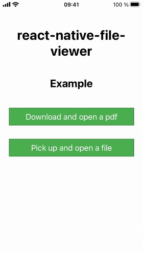

# react-native-file-viewer

Native file viewer for react-native. Preview any type of file supported by the mobile device.

**iOS**: it uses [QuickLook Framework](https://developer.apple.com/library/content/documentation/FileManagement/Conceptual/DocumentInteraction_TopicsForIOS/Articles/UsingtheQuickLookFramework.html)

**Android**: it uses `ACTION_VIEW` Intent to start the default app associated with the specified file.

**Windows**: Start the default app associated with the specified file.



## Getting started

`$ npm install react-native-file-viewer --save`

or

`$ yarn add react-native-file-viewer`

### Mostly automatic installation (recommended)

```
# RN >= 0.60
cd ios && pod install

# RN < 0.60
react-native link react-native-file-viewer
```

#### Extra step (Android only)

If your app is targeting **Android 11 (API level 30) or newer**, the following extra step is required, as described in [Declaring package visibility needs](https://developer.android.com/training/package-visibility/declaring) and [Package visibility in Android 11](https://medium.com/androiddevelopers/package-visibility-in-android-11-cc857f221cd9).

Specifically:

> If your app targets Android 11 or higher and needs to interact with apps other than the ones that are visible automatically, add the <queries> element in your app's manifest file. Within the <queries> element, specify the other apps by package name, by intent signature, or by provider authority, as described in the following sections.

For example, if you know upfront that your app is supposed to open PDF files, the following lines should be added to your `AndroidManifest.xml`.

```diff
    ...
  </application>
+ <queries>
+   <intent>
+     <action android:name="android.intent.action.VIEW" />
+     <!-- If you don't know the MIME type in advance, set "mimeType" to "*/*". -->
+     <data android:mimeType="application/pdf" />
+   </intent>
+ </queries>
</manifest>
```

**IMPORTANT**: Try to be as granular as possible when defining your own queries. This might affect your Play Store approval, as mentioned in [Package visibility filtering on Android](https://developer.android.com/training/package-visibility).

> If you publish your app on Google Play, your app's use of this permission is subject to approval based on an upcoming policy.

### Expo

If your project is based on [Expo](https://expo.io), you need to eject your project by switching to the [Bare workflow](https://docs.expo.dev/workflow/customizing), in order to use this library.

### Manual installation

#### iOS (CocoaPods)

Add the following to your Podfile:

```
pod 'RNFileViewer', :path => '../node_modules/react-native-file-viewer'
```

#### iOS

1. In XCode, in the project navigator, right click `Libraries` ➜ `Add Files to [your project's name]`
2. Go to `node_modules` ➜ `react-native-file-viewer` and add `RNFileViewer.xcodeproj`
3. In XCode, in the project navigator, select your project. Add `libRNFileViewer.a` to your project's `Build Phases` ➜ `Link Binary With Libraries`
4. Run your project (`Cmd+R`)

#### Android

1. Open up `android/app/src/main/java/[...]/MainApplication.java`

- Add `import com.vinzscam.reactnativefileviewer.RNFileViewerPackage;` to the imports at the top of the file
- Add `new RNFileViewerPackage()` to the list returned by the `getPackages()` method

2. Append the following lines to `android/settings.gradle`:

   ```
   include ':react-native-file-viewer'
   project(':react-native-file-viewer').projectDir = new File(rootProject.projectDir, 	'../node_modules/react-native-file-viewer/android')
   ```

3. Insert the following lines inside the dependencies block in `android/app/build.gradle`:

   ```
   compile project(':react-native-file-viewer')
   ```

4. Locate `react-native-file-viewer` inside `node_modules` folder and copy `android/src/main/res/xml/file_viewer_provider_paths.xml` to your project `res/xml/` directory
5. Add the following lines to `AndroidManifest.xml` between the main `<application></application>` tag:

   ```
   ...
   <application>
   ...
   	<provider
   		android:name="com.vinzscam.reactnativefileviewer.FileProvider"
   		android:authorities="${applicationId}.provider"
   		android:exported="false"
   		android:grantUriPermissions="true">
   		<meta-data
   			android:name="android.support.FILE_PROVIDER_PATHS"
   			android:resource="@xml/file_viewer_provider_paths"
   		/>
   	</provider>
   </application>
   ....
   ```

#### Windows

Follow the instructions in the ['Linking Libraries'](https://github.com/Microsoft/react-native-windows/blob/master/docs/LinkingLibrariesWindows.md) documentation on the react-native-windows GitHub repo. For the first step of adding the project to the Visual Studio solution file, the path to the project should be `../node_modules/react-native-file-viewer/windows/RNFileViewer/RNFileViewer.csproj`.

## Usage

### Open a local file

```javascript
import FileViewer from "react-native-file-viewer";

const path = FileViewer.open(path) // absolute-path-to-my-local-file.
  .then(() => {
    // success
  })
  .catch((error) => {
    // error
  });
```

### Pick up and open a local file #1 (using [react-native-document-picker](https://github.com/Elyx0/react-native-document-picker))

```javascript
import FileViewer from "react-native-file-viewer";
import DocumentPicker from "react-native-document-picker";

try {
  const res = await DocumentPicker.pick({
    type: [DocumentPicker.types.allFiles],
  });
  await FileViewer.open(res.uri);
} catch (e) {
  // error
}
```

### Pick up and open a local file #2 (using [react-native-image-crop-picker](https://github.com/ivpusic/react-native-image-crop-picker))

```javascript
import FileViewer from "react-native-file-viewer";
import ImagePicker from "react-native-image-crop-picker";

ImagePicker.openPicker({})
  .then((image) => FileViewer.open(image.path))
  .catch((error) => {
    // error
  });
```

### Prompt the user to choose an app to open the file with (if there are multiple installed apps that support the mimetype)

```javascript
import FileViewer from "react-native-file-viewer";

const path = FileViewer.open(path, { showOpenWithDialog: true }) // absolute-path-to-my-local-file.
  .then(() => {
    // success
  })
  .catch((error) => {
    // error
  });
```

### Open a file from Android assets folder

Since the library works only with absolute paths and Android assets folder doesn't have any absolute path, the file needs to be copied first. Use [copyFileAssets](https://github.com/itinance/react-native-fs#copyfileassetsfilepath-string-destpath-string-promisevoid) of [react-native-fs](https://github.com/itinance/react-native-fs).

Example (using react-native-fs):

```javascript
import FileViewer from "react-native-file-viewer";
import RNFS from "react-native-fs";

const file = "file-to-open.doc"; // this is your file name

// feel free to change main path according to your requirements
const dest = `${RNFS.DocumentDirectoryPath}/${file}`;

RNFS.copyFileAssets(file, dest)
  .then(() => FileViewer.open(dest))
  .then(() => {
    // success
  })
  .catch((error) => {
    /* */
  });
```

### Download and open a file (using [react-native-fs](https://github.com/itinance/react-native-fs))

No function about file downloading has been implemented in this package.
Use [react-native-fs](https://github.com/itinance/react-native-fs) or any similar library for this purpose.

Example (using react-native-fs):

```javascript
import RNFS from "react-native-fs";
import FileViewer from "react-native-file-viewer";
import { Platform } from "react-native";

const url =
  "https://github.com/vinzscam/react-native-file-viewer/raw/master/docs/react-native-file-viewer-certificate.pdf";

// *IMPORTANT*: The correct file extension is always required.
// You might encounter issues if the file's extension isn't included
// or if it doesn't match the mime type of the file.
// https://stackoverflow.com/a/47767860
function getUrlExtension(url) {
  return url.split(/[#?]/)[0].split(".").pop().trim();
}

const extension = getUrlExtension(url);

// Feel free to change main path according to your requirements.
const localFile = `${RNFS.DocumentDirectoryPath}/temporaryfile.${extension}`;

const options = {
  fromUrl: url,
  toFile: localFile,
};
RNFS.downloadFile(options)
  .promise.then(() => FileViewer.open(localFile))
  .then(() => {
    // success
  })
  .catch((error) => {
    // error
  });
```

## API

### `open(filepath: string, options?: Object): Promise<void>`

| Parameter              | Type   | Description                                                                                                                                                                                                                                        |
| ---------------------- | ------ | -------------------------------------------------------------------------------------------------------------------------------------------------------------------------------------------------------------------------------------------------- |
| **filepath**           | string | The absolute path where the file is stored. The file needs to have a valid extension to be successfully detected. Use [react-native-fs constants](https://github.com/itinance/react-native-fs#constants) to determine the absolute path correctly. |
| **options** (optional) | Object | Some options to customize the behaviour. See below.                                                                                                                                                                                                |

#### Options

| Parameter                          | Type     | Description                                                                                                      |
| ---------------------------------- | -------- | ---------------------------------------------------------------------------------------------------------------- |
| **displayName** (optional)         | string   | Customize the QuickLook title (iOS only).                                                                        |
| **onDismiss** (optional)           | function | Callback invoked when the viewer is being dismissed (iOS and Android only).                                      |
| **showOpenWithDialog** (optional)  | boolean  | If there is more than one app that can open the file, show an _Open With_ dialogue box (Android only).           |
| **showAppsSuggestions** (optional) | boolean  | If there is not an installed app that can open the file, open the Play Store with suggested apps (Android only). |

## Issues

### Android X Breaking changes

The library supports [Android X](https://developer.android.com/jetpack/androidx/) and React Native 0.60+.

If you're using **React Native < 0.60**, please append the following snippet to your `android/app/build.gradle` file:

```
preBuild.doFirst {
    ant.replaceregexp(match:'androidx.core.content.', replace:'android.support.v4.content.', flags:'g', byline:true) {
        fileset(dir: '../../node_modules/react-native-file-viewer/android/src/main/java/com/vinzscam/reactnativefileviewer', includes: '*.java')
    }
}
```

If you prefer to not touch your gradle file, you can still use version `1.0.15` which is perfectly compatible.
